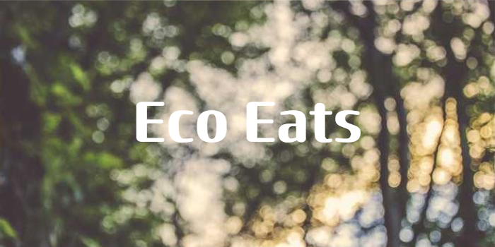
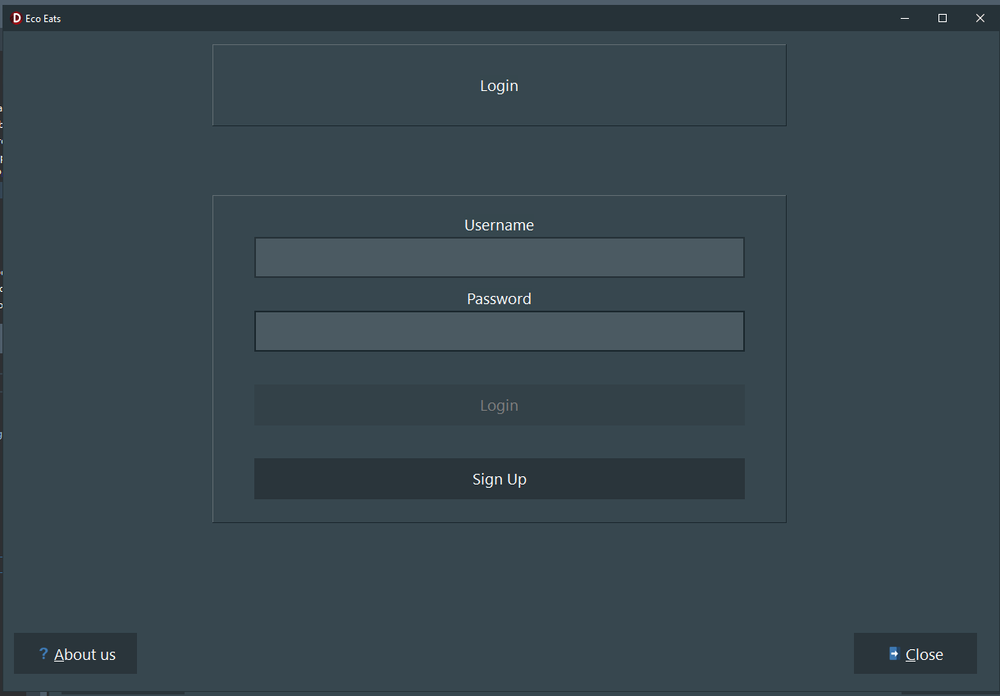
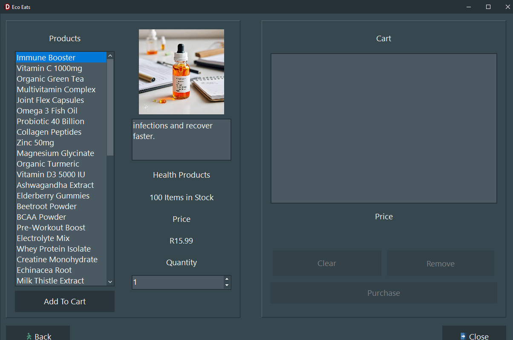
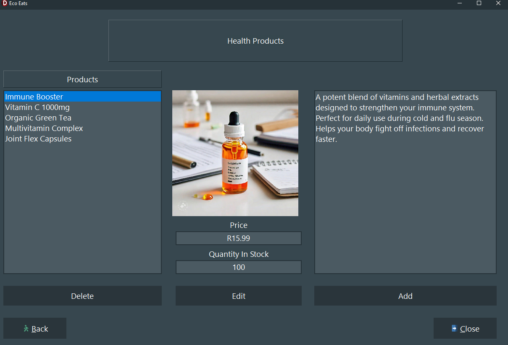

# Eco Eats 

Eco Eats is an e-commerce application developed in Delphi using the VCL framework. This project was created for a school programming assignment.
___

---
## Get Started
In the main directory of the repository, there is a folder named "Sample Data." First, delete all the contents of the "Win32/Debug" folder. Then, copy the contents of the "Sample Data" folder into "Win32/Debug/" if the "Win32" folder does not exist already. You need to run the application once for the "Win32" folder to be created.